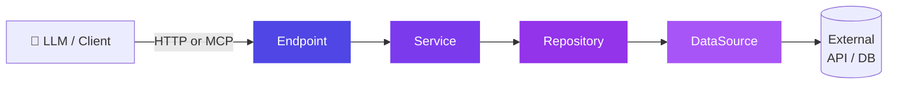
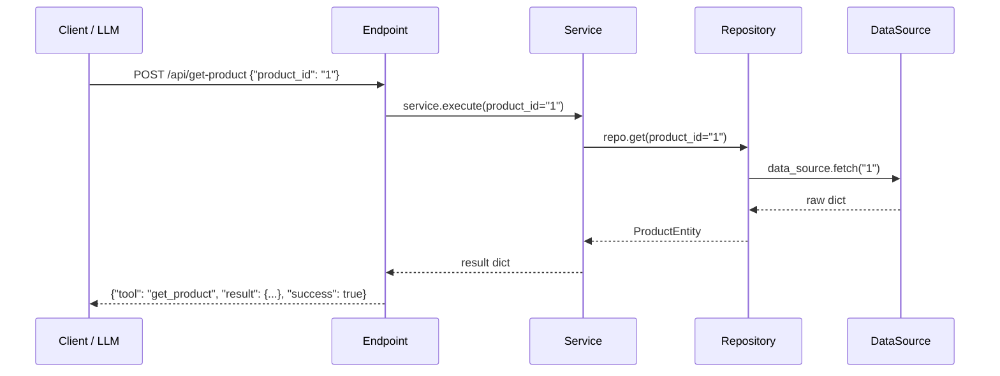
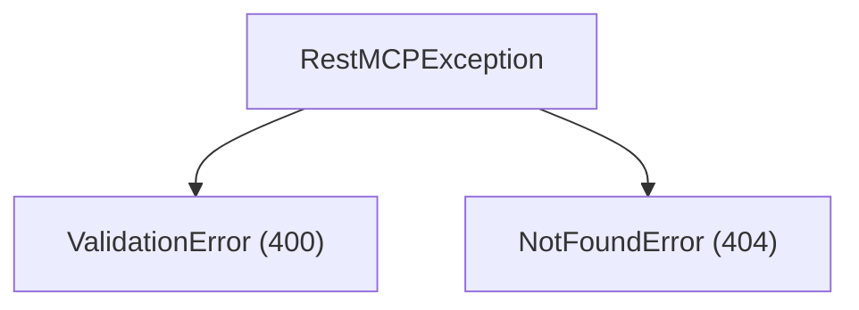

# restmcp

[](https://github.com/JorgeHSantana/restmcp/actions/workflows/publish.yml)
[](https://codecov.io/gh/JorgeHSantana/restmcp)
[](https://pypi.org/project/restmcp/)
[](https://pypi.org/project/restmcp/)
[](LICENSE)

> One framework. MCP tools and REST endpoints, auto-registered.

Python framework for building **MCP servers** with a layered architecture and REST compatibility.  
Annotated classes become MCP tools and HTTP endpoints: auto-registered, dependency-injected, sync/async agnostic.

---

## Architecture



Each layer knows only the layer directly below it. Every class name is suffix-enforced at import time: a typo raises `TypeError` before the server starts.

---

## Installation

```bash
pip install restmcp
```

---

## Quick start

```bash
restmcp new my-server
cd my-server
pip install -e .
python main.py
```

Generated structure:

```
my-server/
├── datasources/       # external connections (APIs, databases)
├── entities/          # domain models (Pydantic)
├── repositories/      # data access layer
├── services/          # business logic
├── utils/             # internal helpers
├── endpoints/         # endpoint definitions (auto-discovered)
├── main.py
└── pyproject.toml
```

---

## Changelog

Release-by-release record in [CHANGELOG.md](CHANGELOG.md) — every behavior/API
change lands there under *Unreleased* and ships with the version bump.

---

## Breaking changes in 0.2.0

Definition errors now fail at **registration (import time)** instead of per-request, always naming the endpoint class or tool:

- Parameter names starting with `_` or `model_` (or that are not valid Python identifiers) are rejected — pydantic silently dropped or refused them before.
- A declared `default` that does not match its declared type is rejected (defaults are now validated and coerced at registration).
- The callback signature must accept every declared property (defaults included) — on 0.1.x this worked on REST and broke only on MCP.

Runtime changes: unknown query-string parameters are now ignored (previously HTTP 400); REST and MCP now validate identically via one shared pydantic model, so HTTP 400 messages are pydantic-style (e.g. "Extra inputs are not permitted"); explicit JSON `null` is accepted only when the property's default is `null`; pydantic-lax boolean inputs (`1`/`0`, `"on"`/`"off"`, `"yes"`/`"no"`) are accepted.

---

## How it works



---

## Base classes

### `DataSource`

Abstracts the connection to an external data source (REST API, database, file).  
**Rule:** class name must end with `DataSource`.

```python
import httpx
from restmcp import DataSource

class ProductApiDataSource(DataSource):
    base_url = "https://api.example.com"

    async def fetch(self, product_id: str) -> dict:
        async with httpx.AsyncClient() as client:
            r = await client.get(f"{self.base_url}/products/{product_id}")
            r.raise_for_status()
            return r.json()
```

---

### `Entity`

Structured domain data backed by Pydantic. Automatic type validation.  
**Rule:** class name must end with `Entity`.

```python
from restmcp import Entity

class ProductEntity(Entity):
    id:    str
    name:  str
    price: float
```

---

### `Repository`

Fetches data via a `DataSource` and returns `Entity` objects. One source, one data type.  
**Rules:** name ends with `Repository`; must declare `data_source` as class attribute; must implement `get()`.

```python
from restmcp import Repository
from datasources.product_api import ProductApiDataSource
from entities.product import ProductEntity

class ProductRepository(Repository):
    data_source = ProductApiDataSource()

    async def get(self, product_id: str) -> ProductEntity:
        raw = await self.data_source.fetch(product_id)
        return ProductEntity(**raw)
```

**Dependency injection:**

```python
repo = ProductRepository()                              # uses real DataSource
repo = ProductRepository(data_source=MockDataSource())  # injects mock for tests
```

`Repository.__init__` uses `copy.copy()` of the class attribute: instances are always isolated.

---

### `Service`

Orchestrates business logic. Where joins, transformations, and multi-source rules live.  
**Rules:** name ends with `Service`; must declare at least one `Repository` as class attribute.

```python
from restmcp import Service
from repositories.product import ProductRepository

class GetProductService(Service):
    repo = ProductRepository()

    async def execute(self, product_id: str) -> dict:
        product = await self.repo.get(product_id=product_id)
        return product.model_dump()
```

**Dependency injection:**

```python
svc = GetProductService()                       # production
svc = GetProductService(repo=MockRepository())  # test
```

Repository class attributes are auto-discovered via MRO and isolated per instance.

---

### `Endpoint`

HTTP + MCP route. **Auto-registers on class definition**: no manual wiring needed.  
**Rules:** name ends with `Endpoint`; must declare `url`, `method`, and `callback`. `mcp_definition` is inferred from the callback when omitted.

```python
from typing import Annotated

from restmcp import Endpoint
from services.product import GetProductService

class GetProductEndpoint(Endpoint):
    url    = "/api/get-product"
    method = "POST"

    async def callback(self, product_id: Annotated[str, "Product ID"]) -> dict:
        """Get a product by ID.

        Returns: the product object (id, name, price, currency).
        """
        return await GetProductService().execute(product_id)
```

The MCP tool name (`get_product`), description (the **full** callback docstring),
and parameter schema (types + `Annotated` text) are inferred from the `callback`.

**The callback docstring must include a `Returns:` section** — the MCP client only
ever sees the tool description, so an inferred tool is required to spell out what it
returns there (the Portuguese `Retorna:`/`Retorno:` are also accepted). Defining an
inferred endpoint without one raises a `TypeError` at class-definition time.

Set `mcp_definition` explicitly only when you need to override the inferred schema;
the `Returns:` requirement does not apply to hand-written definitions.

Defining the class is enough. The route is registered on the `Server` singleton the moment Python processes the class body.

**Choosing the transport (0.3.0+):**

```python
class RejectEndpoint(Endpoint):
    expose = "rest"   # "rest" | "mcp" | "both" (default)
    ...
```

`"rest"` serves the HTTP route but keeps the tool out of the MCP server **and**
the `/mcp/tools` catalog — an agent never even sees it (write endpoints an LLM
must not call, binary downloads that make no sense as tools). `"mcp"` registers
the tool with no public HTTP route (agent-only tools). Invalid values raise at
class definition. The filter is one place (`Server.mcp_handlers`), so the
catalog and the MCP server cannot disagree.

**OpenAPI schemas (0.3.0/0.4.0+):** `/openapi.json` documents every operation
from the same `mcp_definition` the MCP side publishes — REST and MCP cannot
drift:

- **Request** (0.3.0): `requestBody` for `POST/PUT/PATCH`, query `parameters`
  otherwise, plus `operationId` and `description`. `required` mirrors
  validation (a property without a `default`); `additionalProperties: false`
  documents the extra-key rejection.
- **Response** (0.4.0): declare `mcp_definition["returns"]` as the JSON Schema
  of the callback's return value and the `200` documents the
  `{tool, result, success}` envelope with `result` typed by it (open when
  undeclared — the envelope alone already types the skeleton). Errors are
  documented once, under `default`, with the error envelope.

```python
class GetProductEndpoint(Endpoint):
    mcp_definition = {
        "name": "get_product",
        "description": "Get a product by ID.",
        "parameters": {"properties": {"product_id": {"type": "string"}}},
        "returns": {
            "type": "object",
            "properties": {"id": {"type": "string"}, "price": {"type": "number"}},
            "required": ["id", "price"],
        },
    }
    ...
```

Generated clients (`openapi-typescript`, `openapi-python-client`, …) now get
full request/response types — a renamed response field becomes a codegen diff
instead of silently empty UI data.

**Success status code (0.6.0+):** the HTTP code of the success envelope is a
*declaration*, and the same declaration feeds the response and the OpenAPI
document — they cannot disagree:

```python
class StartRunEndpoint(Endpoint):
    success_code = 202   # "accepted, poll for the outcome" — default 200
    ...
```

2xx only, validated at class definition; `204` is rejected (No Content forbids
a body, the envelope always has one). Errors ignore it — their code comes from
the exception class (`RestMCPException.status_code`), so the full picture is:
**error code = exception type, success code = endpoint declaration.**

**Raw responses (0.6.0+):** the FastAPI escape hatch, for responses that do not
fit the envelope (file downloads, redirects, conditional codes, custom
headers). Three locks:

```python
class ExportCsvEndpoint(Endpoint):
    expose = "rest"        # lock 1: no MCP side — required, or import fails
    raw_response = True    # lock 2: opt-in, never inferred from the return type
    ...
    def callback(self, device_id):
        return PlainTextResponse(csv, media_type="text/csv",
                                 headers={"content-disposition": "attachment"})
```

1. **Requires `expose = "rest"`** — a raw HTTP response has no MCP
   representation, so the tool must not exist on that side.
2. **Opt-in declared** — a callback returning a `Response` *without* the flag
   is a programming error (500, pointed message in the log), never a silent
   passthrough; declared but returning plain data errors the same way.
3. **Success only** — exceptions raised in a raw endpoint still produce the
   standard error envelope with the exception's status code: clients keep one
   error format everywhere. Auth, scopes, body limits and parameter validation
   also apply unchanged — the hatch is about the response, not the pipeline.

In OpenAPI a raw operation promises nothing it cannot keep: no success
envelope, one honest `default` describing that code, headers and body belong
to the endpoint.

**Disabling an endpoint:**

```python
class GetProductEndpoint(Endpoint):
    disabled = True  # skips auto-registration; can still be instantiated manually
    ...
```

**Abstract base classes** (missing any required attribute) are never auto-registered:

```python
class BaseAuthEndpoint(Endpoint):
    method = "POST"
    def callback(self, **kwargs): ...
# ↑ not registered: url is missing

class GetUserEndpoint(BaseAuthEndpoint):
    url = "/api/get-user"
    def callback(self, user_id: str) -> dict: ...
# ↑ registered automatically: url, method, and callback all present
```

**Sync and async callbacks** are both supported: restmcp detects and handles either:

```python
# sync: runs in a thread pool, does not block the event loop
def callback(self, product_id: str) -> dict:
    return requests.get(f"https://api.example.com/products/{product_id}").json()

# async: awaited directly; use asyncio.gather for parallel I/O
async def callback(self, product_id: str) -> dict:
    async with httpx.AsyncClient() as client:
        r = await client.get(f"https://api.example.com/products/{product_id}")
        return r.json()
```

**The contract (identical for REST and MCP):**

- A **sync** callback runs in a threadpool, so blocking work — a synchronous DB
  driver, `requests`, file I/O — never stalls the event loop. Writing your
  `Repository`/`DataSource` synchronously is the simple, correct default.
- An **async** callback is awaited directly. Inside it, **keep the I/O async**
  (`httpx`, an async DB driver): calling blocking code from an async callback
  *does* stall the loop, because it is not moved to a thread.

Rule of thumb: sync all the way down, or async all the way down — don't put
blocking calls inside an `async def` callback.

**Response format:**

```json
{ "tool": "get_product", "result": { ... }, "success": true }
```

```json
{ "tool": "get_product", "error": "not found", "error_type": "NotFoundError", "success": false }
```

---

### `Server`

Singleton serving REST (FastAPI/uvicorn) and the MCP protocol (FastMCP) from one
codebase. The recommended entry point is `asgi_app()`, which mounts both:

```python
import uvicorn

from restmcp import Server, autodiscover

autodiscover("endpoints")  # imports every endpoint module so each one registers

app = Server.get_instance().asgi_app()  # REST at "/", MCP at "/mcp-protocol/"

if __name__ == "__main__":
    uvicorn.run(app, host="0.0.0.0", port=8000)
```

```python
# REST only (no MCP), if that is all you need:
Server.get_instance().start(host="0.0.0.0", port=5000)

# The raw FastMCP instance (escape hatch):
mcp = Server.get_instance().get_mcp()
```

**Built-in routes:**

| Route | Method | Auth required |
|-------|--------|---------------|
| `/health` | GET | No |
| `/mcp/tools` | GET | No |
| _your endpoints_ | POST | Yes (if `AUTH_API_KEY` is set) |

---

## Production checklist

- **Running REST + MCP together:** use `app = server.asgi_app()` — it mounts both and wires the FastMCP lifespan. **Do not** call `server.app.mount(...)` directly: it raises "Task group is not initialized" on the first MCP request. MCP is served at the `mcp_path` you pass (default `/mcp-protocol/`, trailing slash); REST stays at `/`.
- **Auth:** set `AUTH_API_KEY` (Bearer). `asgi_app()` protects REST **and** the mounted MCP; `/health` and `/mcp/tools` remain public. Multiple keys: comma-separated.
- **Serialization:** callback return values are serialized with `jsonable_encoder` — `datetime` → ISO 8601, `Decimal` → string, Pydantic models → dict, automatically. Override per-entity via `serialize()`.
- **Typed parameters:** a parameter declared as `{"type": "string", "format": "date-time"}` arrives in the callback as a **string** — coerce to `datetime` if needed.
- **Caching:** wrap an expensive Service method with `@cached_method(ttl=seconds, maxsize=128)` — the cache key is built from the arguments (via `repr`), so it works even with `list`/`dict` args. The store is bounded (`maxsize`) and self-purging (TTL), so it is safe in long-running processes. Cache plain-data arguments, not rich objects.
- **Folders vs suffixes:** only **class suffixes** are enforced (`*Entity`, `*Repository`, `*Service`, `*Endpoint`, `*DataSource`); folder names are free.
- **Dependencies:** `fastmcp` 3.x is recommended (this package requires `fastmcp>=2.0`; upgrade to 3.x for full Streamable HTTP support). Installing fastmcp also pulls in `starlette`.

A complete, runnable server using all of the above lives in [examples/telemetry/](examples/telemetry/) — no database required.

---

## Exceptions

Raised inside `callback`: caught by `Endpoint` and converted to HTTP responses automatically.

```python
from restmcp import ValidationError, NotFoundError

raise ValidationError("product_id is required")  # → HTTP 400
raise NotFoundError("Product not found")          # → HTTP 404
```



---

## Testing with injection

```python
from restmcp import DataSource
from repositories.product import ProductRepository
from services.product import GetProductService

class FakeProductApiDataSource(DataSource):
    async def fetch(self, product_id: str) -> dict:
        return {"id": product_id, "name": "Test Widget", "price": 1.99}

def test_get_product():
    svc = GetProductService(repo=ProductRepository(data_source=FakeProductApiDataSource()))
    result = svc.execute(product_id="1")
    assert result["name"] == "Test Widget"
```

---

## Key identity and scopes (0.5.0+)

`AUTH_API_KEY` entries accept an optional `name:key:scope` form alongside the
plain `key` form (which keeps full scope):

```bash
export AUTH_API_KEY="painel:sk_abc:read, campo:sk_def:read+write, sk_legacy"
```

The matched principal `{"name", "scopes"}` is published as `request.state.auth`
and via the `restmcp.auth.current_auth` contextvar (visible inside sync
callbacks too). Declare `required_scope = "write"` on an `Endpoint` to get a
`403` before the callback when the key lacks it (REST path; on the MCP side,
hide sensitive tools with `expose = "rest"`). The secret itself never
propagates.

---

## Environment variables

| Variable | Default | Description |
|----------|---------|-------------|
| `AUTH_API_KEY` | _(disabled)_ | Bearer token. Multiple keys supported comma-separated. |
| `CORS_ORIGINS` | *(unset — deny)* | Allowed origins, comma-separated. **Absent or empty denies cross-origin (0.5.0; was `*`)** — set `'*'` explicitly to allow any. A warning is logged when denied by omission. |
| `MAX_BODY_BYTES` | `1048576` | Global request-body ceiling (bytes); bodies over it get **413**. Override per endpoint with the `max_body_bytes` class attribute. |
| `LOG_LEVEL` | `INFO` | Log level: `DEBUG`, `INFO`, `WARNING`, `ERROR`. |

---

## Naming conventions

All base classes enforce a suffix. Violating it raises `TypeError` at import time: before the server starts.

| Base class | Required suffix | Example |
|------------|----------------|---------|
| `DataSource` | `*DataSource` | `ProductApiDataSource` |
| `Entity` | `*Entity` | `ProductEntity` |
| `Repository` | `*Repository` | `ProductRepository` |
| `Service` | `*Service` | `GetProductService` |
| `Endpoint` | `*Endpoint` | `GetProductEndpoint` |

---

## Dependencies

```
fastapi    >= 0.100
uvicorn    >= 0.20
fastmcp    >= 2.0
pydantic   >= 2.0
click      >= 8.0
```

---

## Author

**Jorge Henrique Moreira Santana**  
Electrical Engineer, Postgraduate in Artificial Intelligence  
[LinkedIn](https://www.linkedin.com/in/jorge-santana-b246874a/) · jorge.henrique.moreira.santana@gmail.com

---

## License

[MIT](LICENSE)
