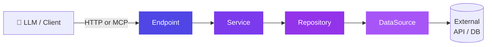
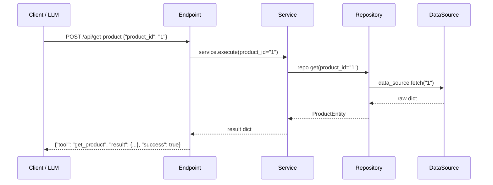
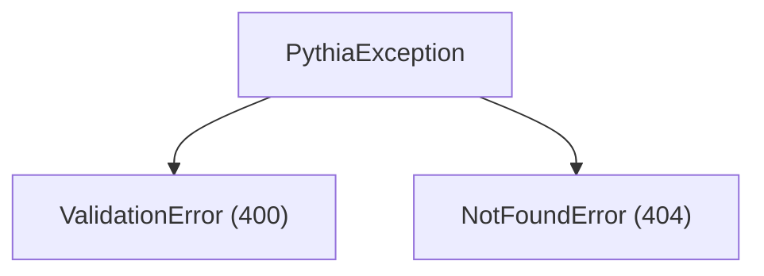

# restmcp

[](https://codecov.io/gh/JorgeHSantana/restmcp)

> One framework. MCP tools and REST endpoints, auto-registered.

Python framework for building **MCP servers** with a layered architecture and REST compatibility.  
Annotated classes become MCP tools and HTTP endpoints: auto-registered, dependency-injected, sync/async agnostic.

---

## Architecture



Each layer knows only the layer directly below it. Every class name is suffix-enforced at import time: a typo raises `TypeError` before the server starts.

---

## Installation

```bash
pip install restmcp
```

---

## Quick start

```bash
restmcp new my-server
cd my-server
pip install -e .
python main.py
```

Generated structure:

```
my-server/
├── datasource/        # external connections (APIs, databases)
├── models/            # domain entities (Pydantic)
├── repositories/      # data access layer
├── services/          # business logic
├── tools/             # internal utilities
├── urls/              # endpoint definitions (auto-discovery)
├── main.py
└── pyproject.toml
```

---

## How it works



---

## Base classes

### `DataSource`

Abstracts the connection to an external data source (REST API, database, file).  
**Rule:** class name must end with `DataSource`.

```python
import httpx
from restmcp import DataSource

class ProductApiDataSource(DataSource):
    base_url = "https://api.example.com"

    async def fetch(self, product_id: str) -> dict:
        async with httpx.AsyncClient() as client:
            r = await client.get(f"{self.base_url}/products/{product_id}")
            r.raise_for_status()
            return r.json()
```

---

### `Entity`

Structured domain data backed by Pydantic. Automatic type validation.  
**Rule:** class name must end with `Entity`.

```python
from restmcp import Entity

class ProductEntity(Entity):
    id:    str
    name:  str
    price: float
```

---

### `Repository`

Fetches data via a `DataSource` and returns `Entity` objects. One source, one data type.  
**Rules:** name ends with `Repository`; must declare `data_source` as class attribute; must implement `get()`.

```python
from restmcp import Repository
from datasource.product_api import ProductApiDataSource
from models.product import ProductEntity

class ProductRepository(Repository):
    data_source = ProductApiDataSource()

    async def get(self, product_id: str) -> ProductEntity:
        raw = await self.data_source.fetch(product_id)
        return ProductEntity(**raw)
```

**Dependency injection:**

```python
repo = ProductRepository()                              # uses real DataSource
repo = ProductRepository(data_source=MockDataSource())  # injects mock for tests
```

`Repository.__init__` uses `copy.copy()` of the class attribute: instances are always isolated.

---

### `Service`

Orchestrates business logic. Where joins, transformations, and multi-source rules live.  
**Rules:** name ends with `Service`; must declare at least one `Repository` as class attribute.

```python
from restmcp import Service
from repositories.product import ProductRepository

class GetProductService(Service):
    repo = ProductRepository()

    async def execute(self, product_id: str) -> dict:
        product = await self.repo.get(product_id=product_id)
        return product.model_dump()
```

**Dependency injection:**

```python
svc = GetProductService()                       # production
svc = GetProductService(repo=MockRepository())  # test
```

Repository class attributes are auto-discovered via MRO and isolated per instance.

---

### `Endpoint`

HTTP + MCP route. **Auto-registers on class definition**: no manual wiring needed.  
**Rules:** name ends with `Endpoint`; must declare `mcp_definition`, `url`, `method`, and `callback`.

```python
from restmcp import Endpoint
from services.product import GetProductService

class GetProductEndpoint(Endpoint):
    mcp_definition = {
        "name":        "get_product",
        "description": "Returns a product by ID",
        "parameters": {
            "properties": {
                "product_id": {"type": "string", "description": "Product ID"},
            },
        },
    }
    url    = "/api/get-product"
    method = "POST"

    async def callback(self, product_id: str) -> dict:
        return await GetProductService().execute(product_id)
```

Defining the class is enough. The route is registered on the `Server` singleton the moment Python processes the class body.

**Disabling an endpoint:**

```python
class GetProductEndpoint(Endpoint):
    disabled = True  # skips auto-registration; can still be instantiated manually
    ...
```

**Abstract base classes** (missing any required attribute) are never auto-registered:

```python
class BaseAuthEndpoint(Endpoint):
    method = "POST"
    def callback(self, **kwargs): ...
# ↑ not registered: url and mcp_definition are missing

class GetUserEndpoint(BaseAuthEndpoint):
    mcp_definition = { ... }
    url = "/api/get-user"
# ↑ registered automatically: all required attributes present
```

**Sync and async callbacks** are both supported: restmcp detects and handles either:

```python
# sync: runs in a thread pool, does not block the event loop
def callback(self, product_id: str) -> dict:
    return requests.get(f"https://api.example.com/products/{product_id}").json()

# async: awaited directly; use asyncio.gather for parallel I/O
async def callback(self, product_id: str) -> dict:
    async with httpx.AsyncClient() as client:
        r = await client.get(f"https://api.example.com/products/{product_id}")
        return r.json()
```

**The contract (identical for REST and MCP):**

- A **sync** callback runs in a threadpool, so blocking work — a synchronous DB
  driver, `requests`, file I/O — never stalls the event loop. Writing your
  `Repository`/`DataSource` synchronously is the simple, correct default.
- An **async** callback is awaited directly. Inside it, **keep the I/O async**
  (`httpx`, an async DB driver): calling blocking code from an async callback
  *does* stall the loop, because it is not moved to a thread.

Rule of thumb: sync all the way down, or async all the way down — don't put
blocking calls inside an `async def` callback.

**Response format:**

```json
{ "tool": "get_product", "result": { ... }, "success": true }
```

```json
{ "tool": "get_product", "error": "not found", "error_type": "NotFoundError", "success": false }
```

---

### `Server`

Singleton with dual-mode: HTTP via FastAPI/uvicorn or MCP protocol via FastMCP.

```python
from restmcp import Server
import urls  # triggers auto-discovery of all endpoint modules

server = Server.get_instance()

if __name__ == "__main__":
    server.start(host="0.0.0.0", port=5000)
```

```python
# MCP mode
mcp = server.get_mcp()
```

**Built-in routes:**

| Route | Method | Auth required |
|-------|--------|---------------|
| `/health` | GET | No |
| `/mcp/tools` | GET | No |
| _your endpoints_ | POST | Yes (if `AUTH_API_KEY` is set) |

---

## Production checklist

- **Running REST + MCP together:** use `app = server.asgi_app()` — it mounts both and wires the FastMCP lifespan. **Do not** call `server.app.mount(...)` directly: it raises "Task group is not initialized" on the first MCP request. MCP is served at the `mcp_path` you pass (default `/mcp-protocol/`, trailing slash); REST stays at `/`.
- **Auth:** set `AUTH_API_KEY` (Bearer). `asgi_app()` protects REST **and** the mounted MCP; `/health` and `/mcp/tools` remain public. Multiple keys: comma-separated.
- **Serialization:** callback return values are serialized with `jsonable_encoder` — `datetime` → ISO 8601, `Decimal` → string, Pydantic models → dict, automatically. Override per-entity via `serialize()`.
- **Typed parameters:** a parameter declared as `{"type": "string", "format": "date-time"}` arrives in the callback as a **string** — coerce to `datetime` if needed.
- **Caching:** wrap an expensive Service method with `@cached_method(ttl=seconds, maxsize=128)` — the cache key is built from the arguments (via `repr`), so it works even with `list`/`dict` args. The store is bounded (`maxsize`) and self-purging (TTL), so it is safe in long-running processes. Cache plain-data arguments, not rich objects.
- **Folders vs suffixes:** only **class suffixes** are enforced (`*Entity`, `*Repository`, `*Service`, `*Endpoint`, `*DataSource`); folder names are free.
- **Dependencies:** `fastmcp` 3.x is recommended (this package requires `fastmcp>=2.0`; upgrade to 3.x for full Streamable HTTP support). Installing fastmcp also pulls in `starlette`.

A complete, runnable server using all of the above lives in [examples/telemetry/](examples/telemetry/) — no database required.

---

## Exceptions

Raised inside `callback`: caught by `Endpoint` and converted to HTTP responses automatically.

```python
from restmcp import ValidationError, NotFoundError

raise ValidationError("product_id is required")  # → HTTP 400
raise NotFoundError("Product not found")          # → HTTP 404
```



---

## Testing with injection

```python
from restmcp import DataSource
from repositories.product import ProductRepository
from services.product import GetProductService

class FakeProductApiDataSource(DataSource):
    async def fetch(self, product_id: str) -> dict:
        return {"id": product_id, "name": "Test Widget", "price": 1.99}

def test_get_product():
    svc = GetProductService(repo=ProductRepository(data_source=FakeProductApiDataSource()))
    result = svc.execute(product_id="1")
    assert result["name"] == "Test Widget"
```

---

## Environment variables

| Variable | Default | Description |
|----------|---------|-------------|
| `AUTH_API_KEY` | _(disabled)_ | Bearer token. Multiple keys supported comma-separated. |
| `CORS_ORIGINS` | `*` | Allowed origins. Multiple values supported comma-separated. |
| `LOG_LEVEL` | `INFO` | Log level: `DEBUG`, `INFO`, `WARNING`, `ERROR`. |

---

## Naming conventions

All base classes enforce a suffix. Violating it raises `TypeError` at import time: before the server starts.

| Base class | Required suffix | Example |
|------------|----------------|---------|
| `DataSource` | `*DataSource` | `ProductApiDataSource` |
| `Entity` | `*Entity` | `ProductEntity` |
| `Repository` | `*Repository` | `ProductRepository` |
| `Service` | `*Service` | `GetProductService` |
| `Endpoint` | `*Endpoint` | `GetProductEndpoint` |

---

## Dependencies

```
fastapi    >= 0.100
uvicorn    >= 0.20
fastmcp    >= 2.0
pydantic   >= 2.0
click      >= 8.0
```

---

## Author

**Jorge Henrique Moreira Santana**  
Electrical Engineer, Postgraduate in Artificial Intelligence  
[LinkedIn](https://www.linkedin.com/in/jorge-santana-b246874a/) · jorge.henrique.moreira.santana@gmail.com

---

## License

[MIT](LICENSE)
